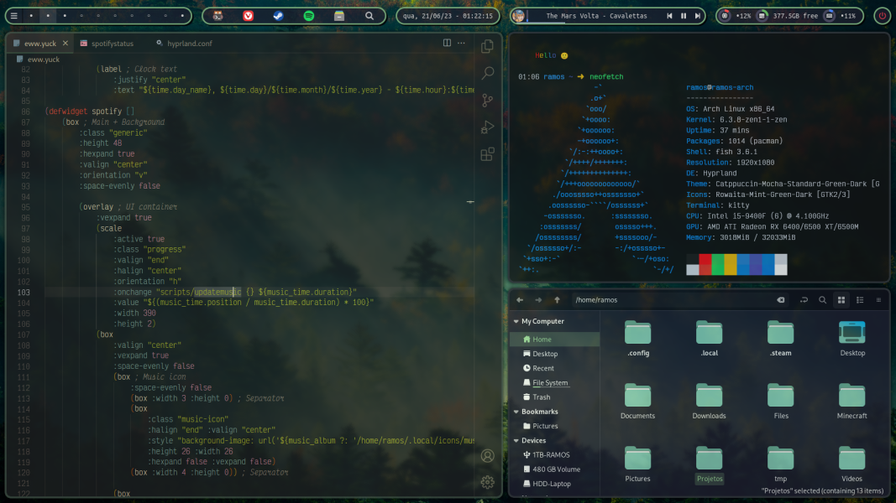
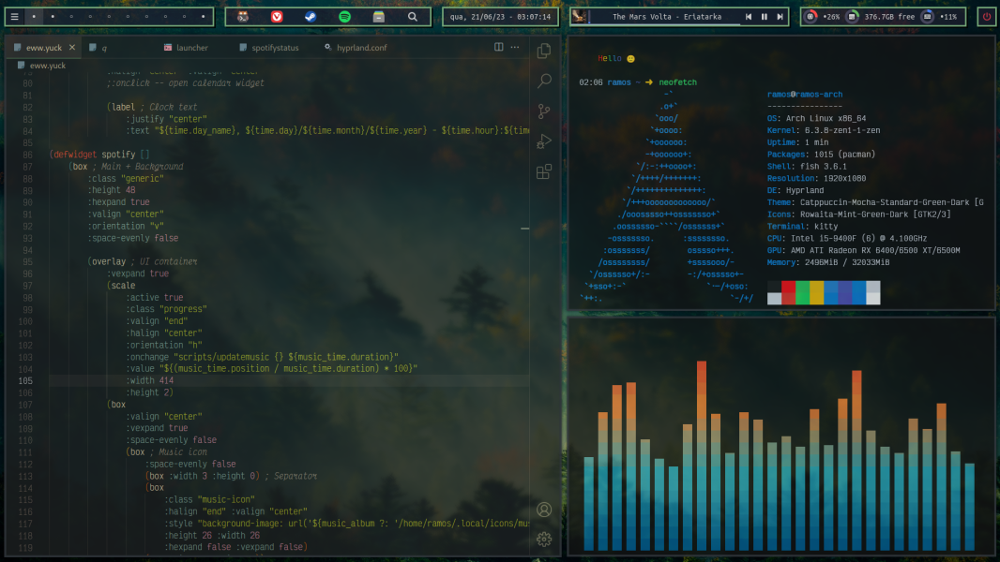

# _Green 🍃_
My dotfiles

Fonts:
 - [VictorMono](https://rubjo.github.io/victor-mono/) for terminal & text editor
 - Ubuntu Mono for pretty much everything else

Theme:
  - [Catppuccin Mocha Green Dark](https://github.com/catppuccin/catppuccin)

Icons:
  - [Rowaita Mint Green Dark](https://github.com/4e6anenk0/Rowaita-icon-theme)

Cursor:
  - [WinSur Dark Cursors](https://github.com/yeyushengfan258/WinSur-dark-cursors)

Previews:

For square//round corners change border-radius in eww.scss and rounding in hyprland.conf to 0.

_(some stuff might be kinda rough around the edges or incomplete)_
