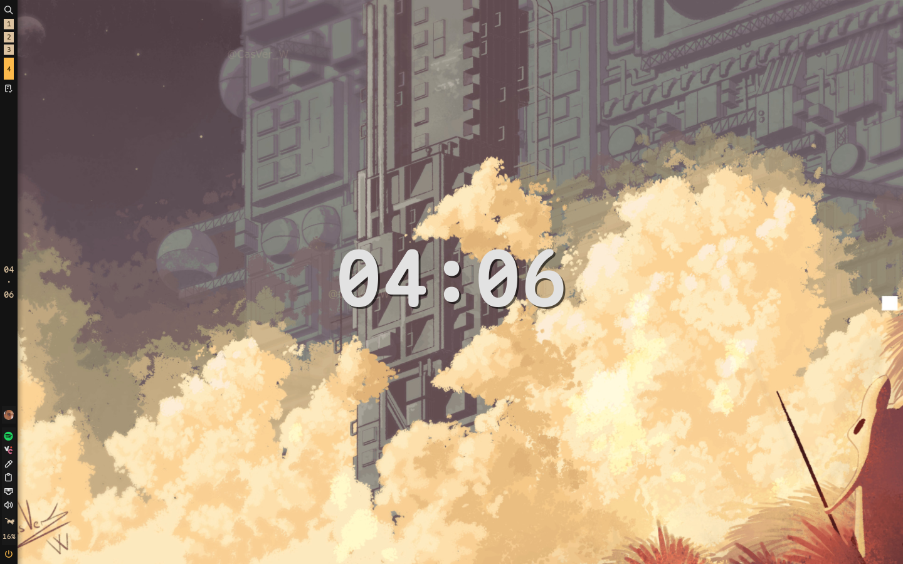
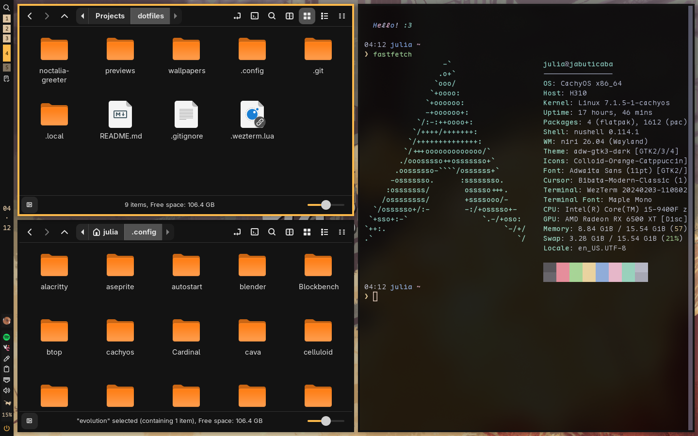
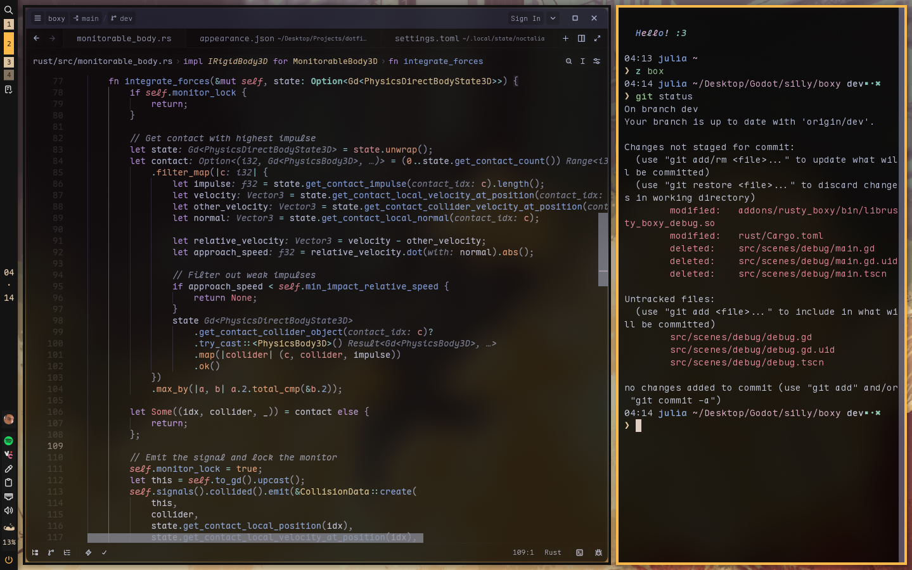
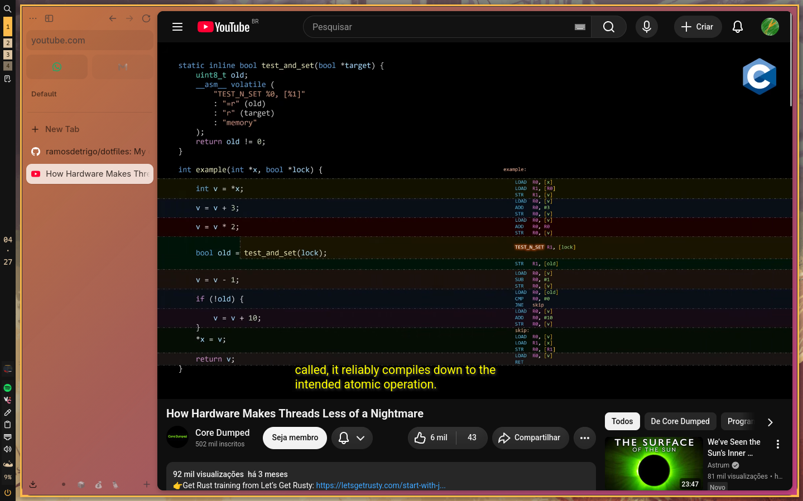
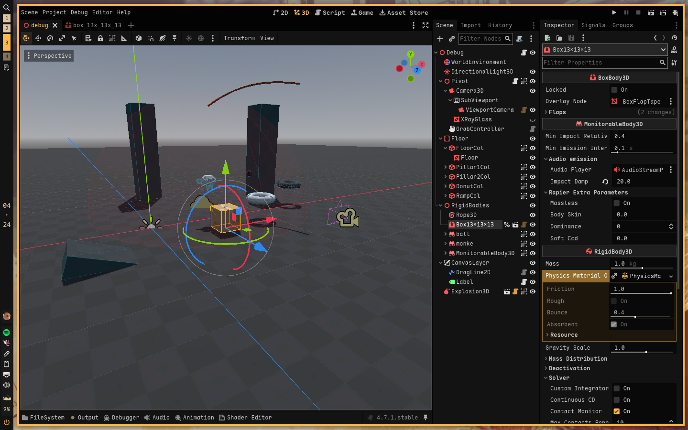

# Dotfiles 👀
My dotfiles! :3

*More screenshots below!*

## *Featuring...*
 - [Arch Linux](https://wiki.archlinux.org/title/Arch_Linux) as OS btw
 - [Noctalia](https://github.com/noctalia-dev/noctalia) Main shell//UI
 - [Noctalia Greeter](https://github.com/noctalia-dev/noctalia-greeter) as Login Screen
 - [Niri](https://github.com/niri-wm/niri) as window manager
 - [Wezterm](https://wezterm.org) as terminal
 - [Zed](https://zed.dev/) **With all AI features disabled** as IDE (it's pretty good!)
 - [Zen Browser](https://zen-browser.app/) as browser
 - [Spicetify](https://spicetify.app) as the thing that makes spotify pretty

### Fonts:
 - [Maple Mono](https://github.com/subframe7536/maple-font) for basically everything :p

### Color scheme:
 - Noctalia auto-generated theme from wallpaper
 - [Catppuccin](https://github.com/catppuccin/catppuccin) for basically everything else - text editor, terminal, etc.

### Icons:
 - [Colloid Orange](https://github.com/vinceliuice/Colloid-icon-theme) (icons)
 - [Bibata Modern Classic](https://www.gnome-look.org/p/1914825) (cursor)

# A few other pretty images!!

