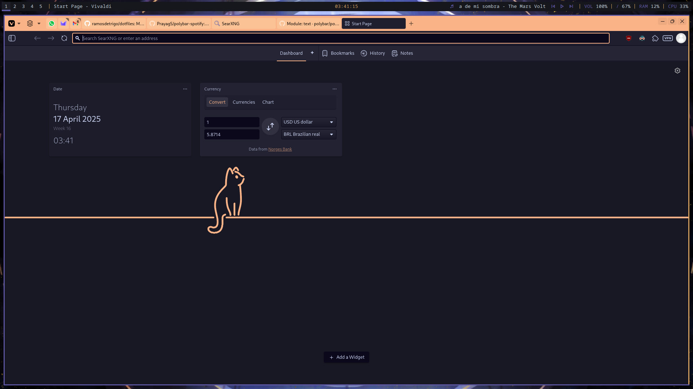

# Dotfiles 👀
My dotfiles! So peeping...

*more previews below!!!*

### *Featuring...*
 - [Arch Linux](https://wiki.archlinux.org/title/Arch_Linux) as OS btw
 - [Lemurs](https://github.com/coastalwhite/lemurs) as lockscreen (not shown)
 - [i3](https://github.com/i3/i3) as window manager!
 - [Polybar](https://github.com/polybar/polybar/) as... bar. yeah.
 - [Fish](https://fishshell.com) as shell ;D
 - [Wezterm](https://wezterm.org) as terminal cuz kitty has a fake scrollbar (???????)
 - [Neovim](https://neovim.io) as editor but VSCodium is pretty nice too ig
 - [Vivaldi](https://vivaldi.com/) as browser
 - [Flameshot](https://flameshot.org) as screenshot tool
 - [Spicetify](https://spicetify.app) as the thing that makes spotify pretty
 - [Cava](https://github.com/karlstav/cava) as the music visualizer thingy yay
 - also [Lite XL](https://github.com/lite-xl/lite-xl) as a fast text editor for general purposes (not shown) but I'm trying to switch to nvim
 - srsly why does kitty have a fake scrollbar? you can't scroll it what even

Fonts:
 - [Victor Mono](https://rubjo.github.io/victor-mono/) for terminal & text editor
 - Plain ol' monospace for polybar

Color scheme:
 - [Kanawaga](https://github.com/rebelot/kanagawa.nvim/tree/master) for neovim (I use the palette for the rest of the system too!)
 - [Catppuccin](https://github.com/catppuccin/catppuccin) for terminal, vivaldi and cava [(themes for vivaldi here)](https://github.com/catppuccin/vivaldi/releases/tag/1.0.0-ctpv2)

Icons:
 - [Colloid Orange Dracula](https://github.com/vinceliuice/Colloid-icon-theme) (icons)
 - [Bibata Modern Classic](https://www.gnome-look.org/p/1914825) (cursor)

# A few other pretty images!! (more previews.)

